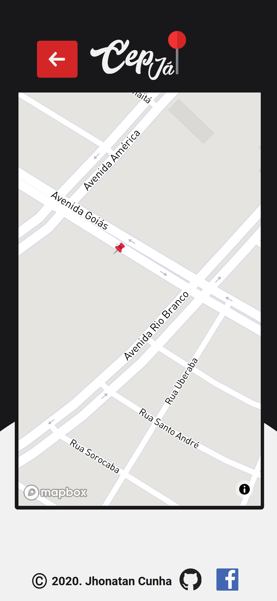

<h1 align="center">:pushpin: CepJá - Consulta de CEP<h1>
<p align="center">


</p>

<br>


## :ballot_box_with_check: Demo Live
- [Netlify - Clique Aqui](https://cepja.netlify.app/)

## :bookmark: Sobre


<p align="center">
    Aplicativo de busca e consulta de todos os CEPS do Brasil, permitindo sua visualização em mapa. Busca permitida via cidade, municio e logradouro, ou somente via cep diretamente. 
</p>

<br>

# :computer: Web View

## :house: Index Page
<p align="center">
    
</p>

## :floppy_disk: Information Page
<p align="center">
    
</p>

## :earth_americas: Map Page
<p align="center">
    
</p>

# :iphone: Mobile View

<table align="center">
    <tr>
        <td></td>
        <td></td>
        <td></td>
    </tr>
 </table>


## 🚀 Tecnologias

- [ReactJS](https://pt-br.reactjs.org/)
- [Redux](https://redux.js.org/)
- [Create React App](https://pt-br.reactjs.org/docs/create-a-new-react-app.html)
- [Styled-Components](https://styled-components.com/)

## ❓ Como utilizar?

```bash
$ cd cep-ja
$ yarn
$ yarn start
```

## :octocat: Como contribuir?

```bash
$ git clone https://github.com/jhonatancunha/cep-ja.git
$ git checkout -b contribution-branch
$ git commit -m "My changes"
$ git push origin contribution-branch
```

# :ballot_box_with_check: Icons

- [Search Icon](https://www.flaticon.com/free-icon/magnifying-glass_1086933?term=search&page=1&position=40)

- [Pin Icon](https://www.flaticon.com/free-icon/pin_787552?term=pin&page=2&position=57)

- [Error Icon](https://www.flaticon.com/free-icon/siren_3068213?term=warning&page=1&position=34)

- [Arrow Icon](https://www.flaticon.com/free-icon/right-arrow_271226?term=ARROW&page=1&position=1)

- [GPS Illustration](https://www.freepik.com/free-vector/smartphone-with-gps-navigation-app_5151545.htm)
  
<p align="center">
Made with :coffee: por :copyright: Jhonatan Cunha.
</p>
